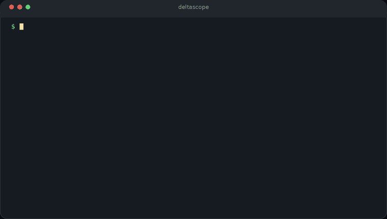

<div align="center">

# DeltaScope

[](https://github.com/Fanduzi/DeltaScope/releases)


[](LICENSE)

[](README.md) [](README_ZH.md)

[](CHANGELOG.md) [](SECURITY.md) [](LICENSE) [](docs/releases/README.md)
</div>

SQL audit for MySQL, TiDB, and PostgreSQL — works offline, or connect to the database for metadata-aware review.

<div align="center">
<table>
  <tr>
    <td align="center" valign="top" width="33%">
      <p><strong>MySQL DML</strong></p>
      
      <p><code>delete from users</code></p>
    </td>
    <td align="center" valign="top" width="33%">
      <p><strong>MySQL DDL</strong></p>
      
      <p><code>alter table users drop column email</code></p>
    </td>
    <td align="center" valign="top" width="33%">
      <p><strong>PostgreSQL</strong></p>
      
      <p><code>--dialect postgresql</code><br><code>alter table users drop column email</code></p>
    </td>
  </tr>
</table>
</div>

## Install

The repository installer script is the generic portable installer. It resolves the same release archives CI publishes.

```bash
curl -fsSL https://raw.githubusercontent.com/Fanduzi/DeltaScope/main/install.sh | sh
```

macOS can also use Homebrew:

```bash
brew tap Fanduzi/deltascope
brew install --cask deltascope
```

Pin a specific release:

```bash
curl -fsSL https://raw.githubusercontent.com/Fanduzi/DeltaScope/v0.490.0/install.sh | \
  DELTASCOPE_VERSION=v0.490.0 sh
```

## MCP

The MCP launcher fetches the `deltascope-mcp` binary for your platform. You do not need to install the CLI first. The launcher is `npx -y @fanduzi/deltascope-mcp`.

Example `mcp.json`:

```json
{
  "mcpServers": {
    "deltascope": {
      "command": "npx",
      "args": ["-y", "@fanduzi/deltascope-mcp"]
    }
  }
}
```

More install options: [MCP Quick Start](#mcp-quick-start).

## Compared with

| Project | What it is |
|---------|------------|
| [Yearning](https://github.com/cookieY/Yearning) / [SQLE](https://github.com/actiontech/sqle) | Work-order / pre-approval platforms with a UI |
| [sqlfluff](https://github.com/sqlfluff/sqlfluff) | SQL linter and formatter |
| [goInception](https://github.com/hanchuanchuan/goInception) | Chinese audit engine, often used behind [Archery](https://github.com/hhyo/Archery) |
| **DeltaScope** | CLI + CI + MCP. No ticket UI. Works offline, or connect for live metadata. |

## Quick Start

Audit a risky DML statement:

```bash
deltascope audit --sql "delete from users"
```

Example excerpt:

```text
Verdict: reject
Statements: 1
Blockers: 1
Warnings: 0
Notices: 0

Statement 1: DELETE
- [blocker] dml.where.require: UPDATE and DELETE statements must include a WHERE clause
```

Audit a `CREATE TABLE` statement:

```bash
deltascope audit --sql "create table tbl_users (id bigint unsigned not null auto_increment comment 'id', created_at datetime not null default current_timestamp comment 'created', updated_at datetime not null default current_timestamp on update current_timestamp comment 'updated', primary key (id)) comment='users' engine=InnoDB default charset=utf8mb4"
```

Example excerpt:

```text
Verdict: review
Statements: 1
Blockers: 0
Warnings: 1
Notices: 0

Statement 1: CREATE TABLE
- [warning] ddl.column.default.require: column "id" should define a default value
```

Audit a file:

```bash
deltascope audit --file ./migrations/20260328_add_column.sql
```

Use JSON output for CI or agents:

```bash
deltascope audit \
  --sql "create table tbl_users (id bigint unsigned not null auto_increment comment 'id', created_at datetime not null default current_timestamp comment 'created', updated_at datetime not null default current_timestamp on update current_timestamp comment 'updated', primary key (id)) comment='users' engine=InnoDB default charset=utf8mb4" \
  --format json \
  --fail-on warning
```

Example JSON shape:

```json
{
  "verdict": "review",
  "summary": {
    "statements": 1,
    "blockers": 0,
    "warnings": 1,
    "notices": 0
  },
  "statements": [ ... ],
  "context": {
    "mode": "offline",
    "dialect": "mysql",
    "dialect_source": "default"
  }
}
```

Audit a TiDB statement:

```bash
deltascope audit --dialect tidb --sql "alter table users add column email varchar(255) not null"
```

Audit a PostgreSQL `CREATE TABLE` with constraints:

```bash
deltascope audit \
  --dialect postgresql \
  --sql "create table orders (id bigint primary key, user_id bigint references users(id), amount numeric not null check (amount >= 0))"
```

When SQL looks like PostgreSQL but the dialect is set to MySQL, DeltaScope emits an advisory notice without auto-switching:

```bash
deltascope audit --sql "insert into users(id) values (1) returning id;"
```

To audit PostgreSQL SQL explicitly:

```bash
deltascope audit --dialect postgresql --sql "insert into users(id) values (1) returning id;"
```

Generate SARIF output for GitHub Code Scanning:

```bash
deltascope audit --file ./migrations.sql --format sarif > deltascope.sarif
```

Use CI-native output with any dialect:

```bash
deltascope audit --dialect postgresql --file ./migrations/20260409_add_index.sql --format github-actions
```

Write a short review summary to the GitHub Actions run page with `--format github-summary`:

```bash
deltascope audit --file ./migrations.sql --format github-summary --fail-on none >> "$GITHUB_STEP_SUMMARY"
```

For a complete GitHub Actions workflow that combines a `config lint --strict` gate, inline `github-actions` annotations, and a `github-summary` job summary, see [github-actions.yml](docs/examples/github-actions.yml). Output formats are documented in [cli.md](docs/reference/cli.md).

For GitLab CI, use `--format gitlab-codequality` and publish `gl-code-quality-report.json` as a Code Quality artifact; see [use-deltascope-in-gitlab-ci.md](docs/recipe/use-deltascope-in-gitlab-ci.md).

Validate a policy config in CI. A clean config prints `Config OK`; a config with only replacement-hazard warnings prints `Config OK with warnings` and exits 0. Add `--strict` to fail on those warnings:

```bash
deltascope config lint --file ./deltascope.yaml --strict
```

Follow up with `deltascope config status` to inspect a single rule's effective ON/OFF state.

## Search-focused pages

- [MySQL DDL audit tool](https://deltascope.pages.dev/en/mysql-ddl-audit-tool) — catch risky MySQL schema changes
- [PostgreSQL DDL audit tool](https://deltascope.pages.dev/en/postgresql-ddl-audit-tool) — review PostgreSQL schema changes and DCL
- [SQL migration risk checker](https://deltascope.pages.dev/en/sql-migration-risk-checker) — CI and AI workflow integration

## Dialects & Release Archives

Every tag publishes archives named `deltascope_<version>_<os>_<arch>.tar.gz` containing `deltascope`, `deltascope-server`, and `deltascope-mcp`. All archives support MySQL, TiDB, and PostgreSQL offline audit via `--dialect mysql|tidb|postgresql`. The installer script, Homebrew Cask, and npm MCP launcher all resolve platform-specific archives from GitHub Release assets. See the [audit capability matrix](docs/reference/audit-capability-matrix.md) for per-dialect coverage and [release notes](docs/releases/README.md) for version-by-version changes.

## DML Impact Estimation

For a selective DML such as `DELETE FROM users WHERE id = 42`, DeltaScope may add an `impact` object to the statement result. The object is conservative by design and reports `estimated_rows`, `estimated_ratio`, `risk_level`, `confidence`, `source`, `reason_codes`, and optional `notes`.

```json
{
  "raw_sql": "DELETE FROM users WHERE id = 42",
  "impact": {
    "estimated_rows": 1,
    "estimated_ratio": 0.0001,
    "risk_level": "low",
    "confidence": "high",
    "source": "metadata",
    "reason_codes": ["pk_equality"],
    "notes": ["refined with table statistics"]
  }
}
```

Offline mode uses SQL shape only. Metadata-aware mode may refine the estimate with read-only table statistics. DeltaScope does not execute the DML and does not run `EXPLAIN ANALYZE`.

Audit with live metadata (instance-aware rules):

```bash
deltascope audit \
  --sql "alter table orders add index idx_status (status)" \
  --host 127.0.0.1 --port 3306 --user root --ask-password --schema app
```

Metadata-aware audit with an explicit connect timeout (MySQL):

```bash
deltascope audit \
  --sql "alter table users add column email varchar(255)" \
  --dialect mysql \
  --host 127.0.0.1 --port 3306 --user root --ask-password --schema app \
  --metadata-connect-timeout 5s
```

Metadata-aware audit with PostgreSQL:

```bash
deltascope audit \
  --sql "alter table orders add column status text not null" \
  --dialect postgresql \
  --host 127.0.0.1 --port 5432 --user root --ask-password \
  --database app --schema public \
  --metadata-connect-timeout 5s
```

Metadata-aware audit over TLS:

```bash
deltascope audit \
  --sql "alter table orders add column status text not null" \
  --dialect postgresql \
  --host pg.example.com --port 5432 --user root --ask-password \
  --tls-mode enabled --tls-ca-file /etc/ssl/certs/pg-ca.pem \
  --database app --schema public --metadata-connect-timeout 5s
```

See all shipped rules:

```bash
deltascope rules list
```

## Why DeltaScope

SQL mistakes are cheap to catch before they run and expensive after. DeltaScope gives you one consistent engine across local dev, CI, HTTP service, and MCP so the same policy applies everywhere — no per-tool rule duplication, no dialect surprises.

## Key Features

- Create-table governance across identifiers, comments, primary keys, audit columns, charset/collation, indexes, and table options.
- Alter-table governance for destructive actions, compatibility checks, existence validation, and merge guidance.
- Object-lifecycle checks for `CREATE VIEW`, `DROP TABLE`, `TRUNCATE TABLE`, and database/schema lifecycle DDL across MySQL, TiDB, and PostgreSQL.
- DML protections for `WHERE`, `LIMIT`, `ORDER BY`, subqueries, join conditions, bulk insert patterns, denylisted objects, and conservative affected-row impact estimation.
- Stable product surfaces: `deltascope` CLI, `deltascope-server`, `deltascope-mcp`, and `pkg/deltascope`.
- `deltascope-mcp` is the official MCP stdio server and exposes `audit_sql`, `describe_rule`, `list_rules`, and `get_capabilities`.
- CI outputs preserve source file path and statement-start line numbers for GitHub Actions, SARIF, and GitLab Code Quality formats.

## MCP Quick Start

> **No install required.** The npm launcher fetches and runs the correct `deltascope-mcp` binary for your platform automatically.

Launcher requirements:

- Node.js 24 or newer
- supported native targets: `darwin` or `linux`, `amd64` or `arm64`

Recommended launcher:

```bash
claude mcp add --scope user deltascope -- npx -y @fanduzi/deltascope-mcp
codex mcp add deltascope -- npx -y @fanduzi/deltascope-mcp
```

For raw stdio TOML, native `deltascope-mcp`, direct connection, `connection_ref`, proxy setup, and common errors, see [Use DeltaScope MCP](docs/recipe/use-deltascope-mcp.md).

### MCP with runtime config

Run `deltascope-mcp` with runtime config for logging and metadata defaults:

```bash
deltascope-mcp -runtime-config /etc/deltascope/runtime.yaml
```

MCP stdout logging is forbidden to protect the stdio protocol. Runtime config can set `output: file` or `output: stderr`, but not `stdout`.

### MCP named connection with connect timeout

```yaml
# ~/.config/deltascope/connections.yaml
connections:
  local_mysql:
    host: 127.0.0.1
    port: 3306
    user: root
    password_env: MYSQL_PASSWORD
    schema: app
    dialect: mysql
    connect_timeout: 5s
```

Both named connections and direct connection inputs accept `connect_timeout`. Empty or `0s` falls back to the runtime config default. MySQL, TiDB, and PostgreSQL all support metadata connect timeout.

## AI Agent Skill

> **Works in Claude Code, Codex, Cursor, and 40+ AI coding agents.**
> Install once, get inline SQL review in every session.

DeltaScope ships a universal AI agent skill for inline SQL review during AI coding sessions. The skill detects whether DeltaScope is installed locally, calls it to audit your SQL, and surfaces findings with fix suggestions — without leaving your AI coding session.

```bash
# Install via npx skills (Claude Code, Codex, Cursor and 40+ AI agents)
npx skills add Fanduzi/DeltaScope --skill deltascope-review -a claude-code
```

Install globally (available across all projects):

```bash
npx skills add Fanduzi/DeltaScope --skill deltascope-review -a claude-code -g
```

Keep the skill up to date:

```bash
npx skills update
```

Then invoke in any supported AI session:

```
/deltascope-review
```

Paste a SQL snippet or point to a file — the agent audits it with DeltaScope and suggests fixes. See [skills/README.md](skills/README.md) for full setup and usage.

## More Docs

- [Recipes](docs/recipe/README.md)
- [Dev docs](docs/dev/README.md)
- [Reference docs](docs/reference/README.md)
- [Audit SQL with metadata](docs/recipe/audit-sql-with-metadata.md)
- [Review DDL before migration](docs/recipe/review-ddl-before-migration.md)
- [Guard DML in CI](docs/recipe/guard-dml-in-ci.md)
- [Use with AI agents](docs/recipe/use-with-ai-agents.md)
- [Inspect rules and config](docs/recipe/inspect-rules-and-config.md)
- [Troubleshoot metadata-aware audit](docs/recipe/troubleshoot-metadata-aware-audit.md)

## Documentation

- [Admin docs](docs/admin/README.md)
- [Concept docs](docs/concept/README.md)
- [Dev docs](docs/dev/README.md)
- [Reference docs](docs/reference/README.md)
- [Audit capability matrix](docs/reference/audit-capability-matrix.md)

## Developer Workflows

- `make test` runs `go test ./...`
- `make build` produces all local binaries under `bin/`
- `make build-linux` produces Linux amd64 binaries under `bin/`
- `make test-e2e-cli` runs the Docker-backed metadata CLI smoke suite
- `make pg-unit-test-gates` runs the PostgreSQL-tagged unit gate set
- `make pg-e2e-gates` runs the Docker-backed PostgreSQL CLI, HTTP, and MCP suites
- `make pg-confidence-gates` runs the canonical PostgreSQL confidence closure
- [docs/dev/testing.md](docs/dev/testing.md) covers the full target set

## HTTP Service

Run the HTTP adapter over the same audit engine:

```bash
deltascope-server -listen 127.0.0.1:8083
```

Run with runtime config for logging and metadata defaults:

```bash
deltascope-server -listen 127.0.0.1:8083 -runtime-config /etc/deltascope/runtime.yaml
```

See [docs/examples/runtime-config.yaml](docs/examples/runtime-config.yaml) for a complete runtime config example.

Endpoints:

- `GET /healthz`
- `GET /version`
- `POST /v1/audit`

`POST /v1/audit` supports both offline JSON audit requests and metadata-aware requests with a `connection_id` that references a named connection defined in the server's runtime config. HTTP requests cannot submit credentials directly. The HTTP response keeps the public audit result body and adds a `context` block. See the full contract in [HTTP API reference](docs/reference/http-api.md).

> The CLI retains direct connection flags (`--host`, `--port`, `--user`, `--password-env`, `--ask-password`, `--database`, `--schema`, `--tls-mode`, `--tls-ca-file`). The `connection_id` boundary applies to HTTP only. MCP has no Query Access tool and retains its separate metadata-audit connection model.

### HTTP metadata-aware request with connect timeout

```json
{
  "sql": "alter table users add column email varchar(255)",
  "dialect": "mysql",
  "connection_id": "local_mysql"
}
```

The `connection_id` references a named connection in the server's runtime config (see [docs/examples/runtime-config.yaml](docs/examples/runtime-config.yaml)). The named connection can define `connect_timeout` as a Go duration string (`500ms`, `5s`, `1m`). Empty or `0s` falls back to the runtime config default. Invalid or negative values return a `400` error. MySQL, TiDB, and PostgreSQL all support metadata connect timeout.

## Library Usage

```go
result, err := deltascope.Audit(ctx, deltascope.Request{
    SQL:     "delete from users",
    Dialect: deltascope.DialectMySQL,
})
```

The stable public API lives in [pkg/deltascope](pkg/deltascope/README.md).

## Architecture

DeltaScope keeps one audit path and exposes it through multiple entrypoints. Product-level and implementation-level diagrams live in [docs/concept/architecture.md](docs/concept/architecture.md) and [docs/dev/architecture.md](docs/dev/architecture.md).

### Modules

| Module | Description | Doc |
|--------|-------------|-----|
| `cmd/deltascope` | CLI process entrypoint | [README](cmd/deltascope/README.md) |
| `cmd/deltascope-server` | HTTP service entrypoint | [README](cmd/deltascope-server/README.md) |
| `cmd/deltascope-mcp` | MCP service entrypoint | [README](cmd/deltascope-mcp/README.md) |
| `internal/interfaces` | Transport adapter namespace | [README](internal/interfaces/README.md) |
| `internal/interfaces/cli` | CLI adapter layer | [README](internal/interfaces/cli/README.md) |
| `internal/interfaces/http` | HTTP adapter layer | [README](internal/interfaces/http/README.md) |
| `internal/interfaces/mcp` | MCP adapter layer | [README](internal/interfaces/mcp/README.md) |
| `internal/application` | Use-case orchestration layer | [README](internal/application/README.md) |
| `internal/application/audit` | Application parse/audit orchestration | [README](internal/application/audit/README.md) |
| `internal/application/auditmeta` | Shared metadata-aware audit preparation | [README](internal/application/auditmeta/README.md) |
| `internal/application/policy` | Application policy loader | [README](internal/application/policy/README.md) |
| `internal/domain` | Core domain types and rules | [README](internal/domain/README.md) |
| `internal/domain/spec` | Normalized statement specifications | [README](internal/domain/spec/README.md) |
| `internal/domain/rule` | Rule findings and level model | [README](internal/domain/rule/README.md) |
| `internal/domain/rule/catalog` | Explanation-oriented shipped rule catalog | [README](internal/domain/rule/catalog/README.md) |
| `internal/domain/rule/ddl` | DDL rule catalog | [README](internal/domain/rule/ddl/README.md) |
| `internal/domain/rule/dml` | DML rule catalog | [README](internal/domain/rule/dml/README.md) |
| `internal/domain/policy` | Policy configuration model | [README](internal/domain/policy/README.md) |
| `internal/domain/report` | Audit result aggregation and verdicts | [README](internal/domain/report/README.md) |
| `internal/infrastructure` | Infrastructure adapter layer | [README](internal/infrastructure/README.md) |
| `internal/infrastructure/parser` | Parser adapter namespace | [README](internal/infrastructure/parser/README.md) |
| `internal/infrastructure/parser/tidb` | TiDB parser adapter | [README](internal/infrastructure/parser/tidb/README.md) |
| `internal/infrastructure/config/viper` | YAML config adapter | [README](internal/infrastructure/config/viper/README.md) |
| `internal/infrastructure/metadata/mysql` | Metadata provider for MySQL/TiDB-compatible engines | [README](internal/infrastructure/metadata/mysql/README.md) |
| `internal/infrastructure/output` | Output renderer namespace | [README](internal/infrastructure/output/README.md) |
| `internal/infrastructure/output/markdown` | Markdown renderer | [README](internal/infrastructure/output/markdown/README.md) |
| `internal/infrastructure/output/json` | JSON renderer | [README](internal/infrastructure/output/json/README.md) |
| `configs` | Example configuration files | [README](configs/README.md) |
| `pkg/deltascope` | Stable public package surface | [README](pkg/deltascope/README.md) |
